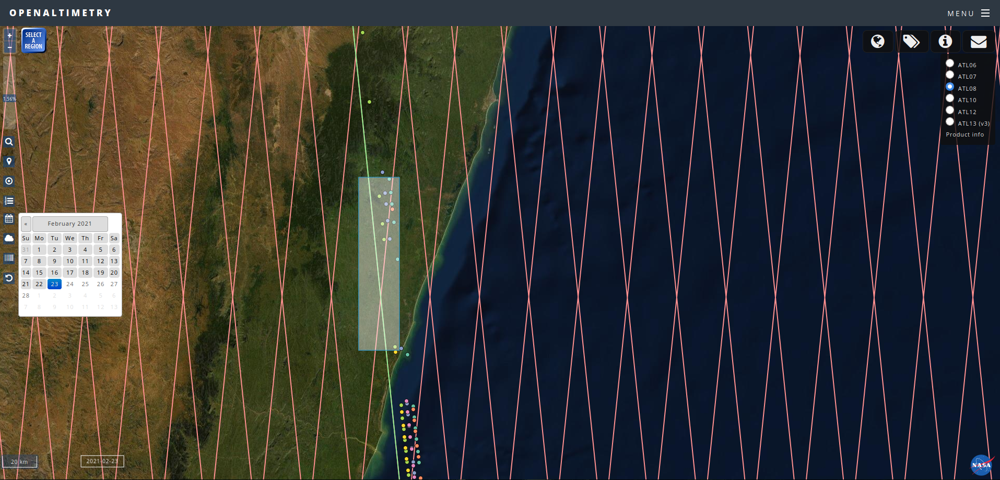

# ICESat-2 Canopy Height

## Objectives

- Visualize canopy height across a transect in Madagascar
- Plot data both in 2D and 3D

## Study Area
- https://www.worldwildlife.org/ecoregions/at0117

## Data
- Data was collected from https://openaltimetry.org/data/icesat2/
- Data was compiled from 9 different passovers: 2018-11-29, 2019-02-28, 2019-05-30, 2019-08-26, 2019-11-27, 2020-05-27, 2020-08-26, 2020-11-24, and 2021-02-23
- Much of the data recorded outlier canopy height greater than 35-meters. For this simple exercise the outlier data were converted to median canopy height.
- Data included NaN or None data were dropped from the visualization

## Results
- 2D representation of latitude (north/south) and canopy height (meters)

- 3D representation of canopy height
